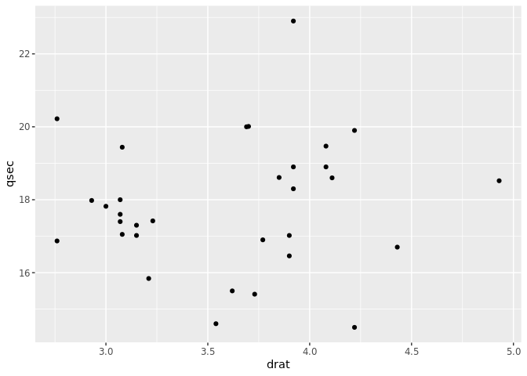

ggplot2 to D3
================
David Sjöberg

In this document some standard ggplot2 plots are replicated in D3.

## Scatterplot

``` r
ggplot(df, aes(drat, qsec)) +
  geom_point()
```



``` {ojs}
//| code-fold: true
d3 = require("d3@7")

function small_grid(A) {
  let middle_pos = []
  for (let i = 0; i < (A.length - 1); i++) {
    let diff = A[i+1]-A[i]
    middle_pos.push(A[i] + diff/2)
  }
  return middle_pos
  }

scatter = {
    const data = await d3.json("data/scatter.json")

    const xAccessor = d => d.drat
    const yAccessor = d => d.qsec
  
    // Dimensions
    let dimensions = {
    width: 750,
    height: 550,
    margins: 60
    };
    
    dimensions.ctrWidth = dimensions.width - dimensions.margins * 2
    dimensions.ctrHeight = dimensions.height - dimensions.margins * 2

    // Draw Image
    const svg = d3.create("svg")
      .attr("width", dimensions.width)
      .attr("height", dimensions.height)

    const ctr = svg.append("g") // <g>
    .attr(
      "transform",
      `translate(${dimensions.margins}, ${dimensions.margins})`
    )

    const xScale = d3.scaleLinear()
      .domain(d3.extent(data, xAccessor))
      .range([0, dimensions.ctrWidth])
      .nice()

    const yScale = d3.scaleLinear()
      .domain(d3.extent(data, yAccessor))
      .range([dimensions.ctrHeight, 0])
      .nice()

  // Axis
  const yAxis = d3.axisLeft(yScale)
    .tickSizeOuter(0)
    .ticks(4)

  const yAxisDOM = ctr.append('g')
    .style("font-size", "14px")
    .call(yAxis)
    .call(g => g.select(".domain").remove())

  yAxisDOM.selectAll("text")
    .style("font-size", "15px")
    .style("color", "grey")

  const xAxis = d3.axisBottom(xScale)
    .tickSizeOuter(0)
    .ticks(5)

  const xAxisDOM = ctr.append('g')
    .style(
      'transform', 
      `translateY(${dimensions.ctrHeight}px)`
      )
    .call(xAxis)
    .call(g => g.select(".domain").remove())

    xAxisDOM.selectAll("text")
      .style("font-size", "15px")
      .style("color", "grey")

    // Panel
    ctr.append("rect")
      .attr("width", dimensions.ctrWidth)
      .attr("height", dimensions.ctrHeight)
      .attr("fill", "#ebebeb");
    
    const xGrid = (g) => g
      .style('stroke', 'white')
      .style('stroke-width', 1.5)
      .selectAll('line')
      .data(xScale.ticks(5))
      .join('line')
      .attr('x1', d => xScale(d))
      .attr('x2', d => xScale(d))
      .attr('y1', 0)
      .attr('y2', dimensions.ctrHeight)

    const xGridMinor = (g) => g
      .style('stroke', 'white')
      .style('stroke-width', .5)
      .selectAll('line')
      .data(small_grid(xScale.ticks(5)))
      .join('line')
      .attr('x1', d => xScale(d))
      .attr('x2', d => xScale(d))
      .attr('y1', 0)
      .attr('y2', dimensions.ctrHeight)

    const yGrid = (g) => g
          .style('stroke', 'white')
          .style('stroke-width', 1.5)
          .selectAll('line')
          .data(yScale.ticks(4))
          .join('line')
          .attr('y1', d => yScale(d))
          .attr('y2', d => yScale(d))
          .attr('x1', 0)
          .attr('x2', dimensions.ctrWidth)

    const yGridMinor = (g) => g
          .style('stroke', 'white')
          .style('stroke-width', 0.5)
          .selectAll('line')
          .data(small_grid(yScale.ticks(4)))
          .join('line')
          .attr('y1', d => yScale(d))
          .attr('y2', d => yScale(d))
          .attr('x1', 0)
          .attr('x2', dimensions.ctrWidth)

        ctr.append('g').call(yGrid)
        ctr.append('g').call(xGrid)
        ctr.append('g').call(xGridMinor)
        ctr.append('g').call(yGridMinor)

    // Geom layer 
    ctr.append('g')
      .selectAll('circle')
      .data(data)
      .join('circle')
      .attr('cx', d => xScale(xAccessor(d)))
      .attr('cy', d => yScale(yAccessor(d)))
      .attr('r', 3)
    
    return svg.node();

}
```
